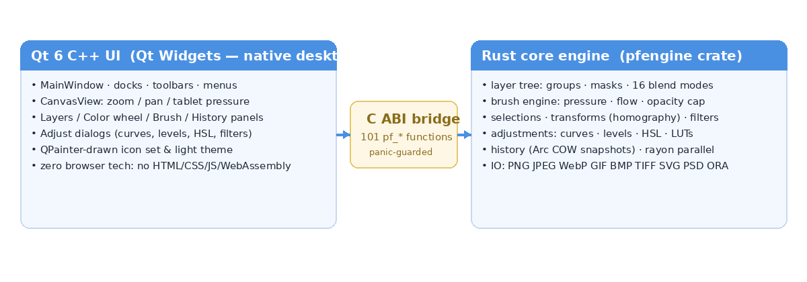

# PixelForge Studio

**A native desktop image editing & digital drawing studio.**
Rust core engine · Qt 6 C++ (Qt Widgets) user interface · stable C ABI bridge.
No browser technologies anywhere in the runtime — no Electron, no WebView, no HTML/CSS/JS/WASM.



## Features

- **Layers** — create, delete, duplicate, reorder, group (nested), per-layer opacity, 16 blend modes (W3C compositing), layer masks (paintable, from selection), merge down, flatten, drag & drop reordering with live thumbnails
- **Brush engine** — brush / pencil / eraser, size, hardness, opacity (stroke cap), flow (buildup), spacing, pressure-sensitive size & opacity (tablet events), soft/hard round, tapered ink, marker & airbrush presets, live stroke preview
- **Selections** — rectangular, elliptical, lasso, magic wand (tolerance + contiguous + composite sampling), add/subtract/intersect modes, feather, invert, select all/none, marching-ants outline, stroke selection, crop-to-selection
- **Transforms** — move, interactive scale/rotate/move (handle overlay), flip H/V, perspective warp (4-corner homography), image resize (nearest/bilinear/bicubic), canvas resize (9 anchors), crop, rotate 90/180/270, trim transparent
- **Color** — hue-ring + SV-square picker, swatch grid, HEX input, FG/BG pairs, palettes (save/load), eyedropper (composite or layer)
- **Adjustments** — brightness/contrast, hue/saturation/lightness, levels (per-channel, histogram), curves (monotone cubic spline, histogram), invert, desaturate, auto contrast, threshold, posterize — all with live engine preview
- **Filters** — gaussian & box blur, unsharp sharpen, noise, pixelate, twirl, wave, find edges, emboss, vignette
- **Shapes & text** — line, rectangle, ellipse, polygon with stroke+fill; text layers (font/size/bold/italic/color)
- **Gradients & fills** — linear/radial, FG→BG / FG→transparent / BG→FG, dithering, bucket fill with tolerance
- **Canvas & documents** — multiple document tabs, zoom (wheel/buttons/fit/100%), pan (space/middle-drag), floating-paper presentation with drop shadow, checkerboard transparency
- **History** — full undo/redo (snapshot-based, Arc-shared memory), history panel with click-to-time-travel, clear
- **Import/export** — PNG, JPEG, WebP (lossless), GIF (incl. animated import as layers), BMP, TIFF, SVG, PSD (import), OpenRaster `.ora` (layered project, round-trip), export scale & JPEG quality & matte color
- **Workspaces & shortcuts** — dockable panels (save/reset workspace), customizable keyboard shortcuts

## Architecture

```
┌────────────────────────────┐        ┌──────────────────────────────┐
│   Qt 6 C++ UI (Widgets)    │  C ABI │      Rust engine (pfengine)  │
│  MainWindow · CanvasView   │◄──────►│  layers · blend · brush      │
│  panels · dialogs · icons  │ pf_*() │  select · adjust · filters   │
└────────────────────────────┘  101   │  transforms · history · io   │
                                 fns  │  (rayon-parallel, panic-     │
                                      │   guarded FFI boundary)      │
                                      └──────────────────────────────┘
```

- The **Rust engine** owns every pixel operation: compositing, blending, brushes,
  selections, adjustments, filters, transforms and file I/O. It is compiled as a
  `cdylib` exposing a stable C ABI (`pf_*` symbols, ~100 functions).
- The **Qt 6 C++ UI** renders the composited RGBA8888 buffer the engine produces
  and forwards every user interaction (mouse, keyboard, tablet pressure) into the
  engine. No pixel math happens in C++.
- **Panic safety**: every FFI entry point is wrapped in `catch_unwind`; a Rust
  panic can never cross into the C++ side.
- **Performance**: layer blending, filters and adjustments are parallelized with
  Rayon; layer buffers are shared via `Arc` so undo history is nearly free in
  memory until a layer actually changes (copy-on-write).

## Building

### Linux

```bash
# dependencies (Debian/Ubuntu)
sudo apt install qt6-base-dev qt6-base-dev-tools libgl1-mesa-dev cmake ninja-build g++ rustup
# build (CMake drives cargo for the engine)
cmake -B build -S app -DCMAKE_BUILD_TYPE=Release
cmake --build build
./build/PixelForge
```

### Windows (MSVC)

```powershell
# Qt 6.8 via the online installer or aqtinstall, Rust via rustup (msvc toolchain)
cmake -B build -S app -DCMAKE_BUILD_TYPE=Release
cmake --build build --config Release
build\Release\PixelForge.exe
```

### Automated self-test

```bash
xvfb-run -a ./build/PixelForge --selftest ./selftest-out
```
Runs **90 checks** through the real UI + engine, including a **full button audit**:

| Audit area | What is verified |
|---|---|
| Menus (A) | all 10 menus populated; all 63 commands reachable from a menu |
| Tool strip (B) | all 18 tools switch via the real actions, have icons, rebuild the options bar; options controls drive settings |
| Canvas tools (C) | Move, Rect/Elliptical/Lasso select, Wand, Eyedropper, Bucket, Gradient, Shape, Text (real dialog flow), Transform (drag + Enter), Perspective (drag corner + Enter), Hand, Zoom (left/right click), Pencil, Eraser, Crop (drag + Apply button) — all through synthesized mouse events |
| Bottom bar (D) | all 5 brush presets set the documented size/hardness and switch to Brush |
| Layers panel (E) | new layer / group / duplicate / move up / move down / merge down / delete / add-mask buttons, blend combo, opacity slider — verified against engine state |
| Color panel (F) | swatch click, HEX entry, swap & default buttons |
| Top bar (G) | 8 buttons: zoom out, zoom combo (typed 200%), undo, redo, flip canvas H/V (pixel round-trip), history toggle, filters dropdown (populated), about dialog |
| Command sweep (H) | every menu command triggered programmatically with modal dialogs auto-dismissed; the window must stay alive after each |
| History panel (I) | list reflects engine history, click-to-jump states, clear button |

Also covered: strokes via synthesized input events, layers, selections, filters,
adjustments, transforms, history, open → edit → export in 6 formats, ORA
round-trip, and screenshots of every step.

Engine unit tests additionally cover image-level flip (all layers, offsets
mirrored, double-flip identity) and the perspective homography (pulls a corner,
tight bbox, real pixel warp).

## Repository layout

```
engine/   Rust core (pfengine) — doc, blend, brush, select, adjust, filters, geom, io, C ABI
app/      Qt 6 C++ application — main window, canvas view, panels, dialogs, icons, theme
assets/   design reference used by the self-test
```

## License

MIT
